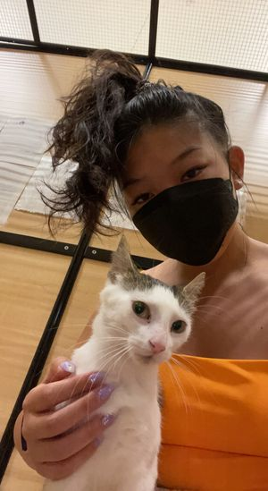
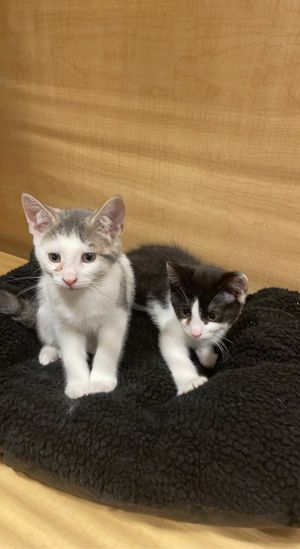
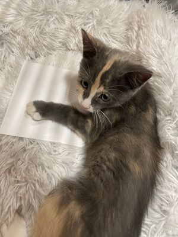
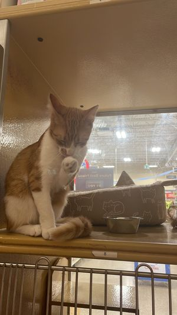
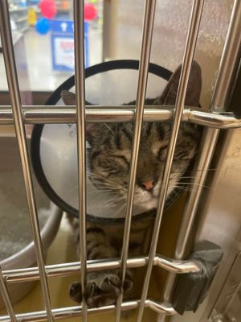
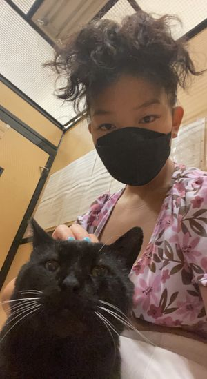

This post is dedicated to those beautiful feline friends I encountered while volunteering for Toronto Cat Rescue. In a tiny room, less than 5 square meters, we shared bonds that could not be understated by the limited time we spent together. These are cats who were born into misery, whose mom was abandoned, who had gone through drastic changes in their lives, or whose existence had been doomed. Yet through these difficult circumstances, they became the most resilient, the sweetest, and the most hopeful creatures I had ever seen. 

## Cookie

Cookie was cuddly. He loved to eat and begged for treats. He was gorgeous. 

## Sensei

Sensei came with her kittens, who were named after the teenage ninja turtles. She was still nursing. An adventurous little one. She was always leading the whole family to escape the tiny adoption centre. She was beautiful and cuddly.

## April and Rafael

April and Rafael were troublemakers who were always wrestling. Rafael had a bad case of biting people for fun. April licked you when you tried to engage in kitten fighting behaviours. 

## Four calioco sisters

The four gorgeous girls were all diluted calico. Two of them were shy and reserved, while their sisters roamed around the centre. Their mom hated the new environment. Four girls got adopted pretty fast. I did fall in love with one of them, a shy little one named Adi. She was too shy to come and snuggle in any way, but her gorgeous and timid eyes were locked on me. She would stand on the edge of the cage, trying to gather the courage to reach out to me. That was the closest I’ve come to almost adopting another cat.

## Gerrard

Gerrard was a loud little guy. His meowing could be heard from across PetSmart. He left on the day I met him to a gorgeous family. He would have a good life. 

## Padou

Padou, a French princess. From the limited interaction I had with her, she craved physical touch. She rubbed her head on mine against the cage.

## Charlie

Charlie was one of the sweetest boys I’ve ever met. He rubbed up on my legs with the force I’ve rarely encountered. He loved sitting on my laps and the tilapia breakfast. He stared at every shopper who stopped by the adoption centre, hoping they would be the one that took him home. Thank god, he got adopted after a week at the adoption centre.

> Photo by <a href="https://unsplash.com/@jaehunpark?utm_source=unsplash&utm_medium=referral&utm_content=creditCopyText">Jae Park</a> on <a href="https://unsplash.com/s/photos/cat?utm_source=unsplash&utm_medium=referral&utm_content=creditCopyText">Unsplash</a>
  