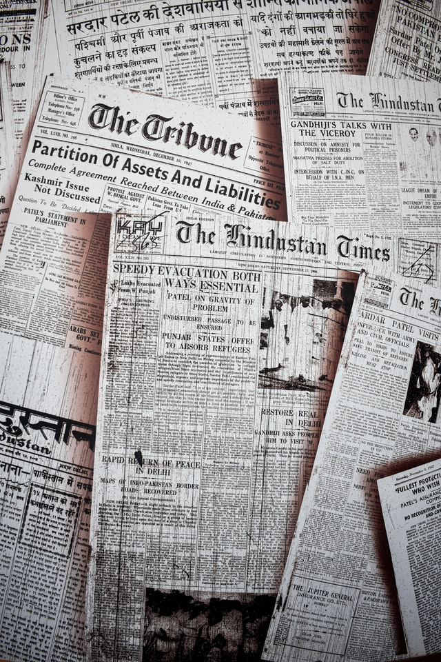

Attention merchants are everywhere, dominating our lives. Here I am, starting my first unplugging ever. Social media, reality TV, and quick mobile game have been deterring me from focusing on my job and people around me. The habitual scrolling or the constant blaring of taboo-filled TV shows are indicators that I have been making a deal with the devil/attention merchants. I have never been one to have set a clear boundary between the internet and I. My friends know me to reply instantly and always be overshare my daily life on social media with no hesitation. This book The Attention Merchants has made me become more aware of how my attentions have been stolen and exchanged.

The book started with an introduction detailing a company named EFP that exchanged students’ attentions for funding for the school board. Essentially, the board entered the agreement to sell students’ attentions in exchange of free money, and corporations could then influence students’ awareness of the brands and establish life-long purchase habits. This real-life story reminds me of one episode of Daria, where the principal brought advertisements into the school for additional funding. The principal avoided scrutiny by hosting a community meeting during the Super Bowls. Even after Daria successfully exposed the principal for the reckless money grabber she was, we saw Daria and Jane walked out of the school building covered in Ultra Cola ads. Jane looked at Daria and declared success sarcastically since the ads could only be displayed outside of school. That storyline is incredibly similar to that of this book and every attention revolution. When a new form of attention merchants emerge, people usually are oblivious. Then they become outraged once these merchants’ evil practices have been exposed. Eventually, the attention merchants provide enough convenience for the users that people just sit there and accept them.

After Wu painted this egregious picture of improper marketing practice, he introduced us to the first attention merchant. Benjamin Day, a print shop proprietor, decided to include advertising in newspapers to reduce cost. His newspaper, the *New York Sun*, became the leading paper in a year solely relying on taboos and its low cost. His practice started a new category of news coverage that used attention grabbing as its main concern. In 1835, the Sun convinced most people that there were little creatures on the moon. 

Wu then introduced the first cultural revolt against the attention merchants. The invention of Jule Chéret , the advertising posters, took over the streets of Paris and started to become an assault on everyone’s eyeballs. This intrusion of attention harvesting eventually led to the anti-poster movement and limited the poster spread. There was something deeper behind simply aesthetic concerns. The awareness of one’s attention being exchanged for financial gains without one’s consent is the ultimate insult.

The industry that became the likely representation of attention merchants turned out to be patent medicine, any sorts of natural healing products that provided nothing of scientific evidence. Claude Hopkins led the campaign to oversell these products and bring the manufacturer a large sum of money, while the actual ingredients of these products had no real medical benefits and were actually toxic. When you find pamphlets from random stores in your mailbox, you have Hopkins to thank! He invented “direct mailing”. When the patent medicine empire of Hopkins was just starting to grow, Samuel Adams, a former crime reporter, exposed the truth behind these products. To the consumer’s shock, some products contained sulphuric acid and the lab testing on animals had led to fatality. FDA was established as a result. 

Wu then described the marketing strategies used by royalty. During the First World War, Lord Kitchener recruited soldiers and inspired the iconic “Uncle Sam”. His fingers pointed to whoever was reading the poster with the caption “Your country needs YOU”. The British invented the war propaganda and would subsequently become the inspiration of the Soviet Union, communist China, and Nazi Germany. America was the next to follow in the political propaganda. George Creel, an assistant to Woodrow Wilson’s campaign, convinced the Americans that going to war was the patriotic choice and spread nationalist propaganda. The ordinary people were giving pro-war speeches, and propaganda films were produced. Uncle Sam came out during this time as well. People who were anti-war were arrested under the Espionage Act. The propaganda of the British and American filled some journalists with dismay, but some paid attention to the effectiveness of total government campaigns. Among those was Hitler.

Wu introduced Scientific Advertising, a term included demand engineering, branding, and targeted advertisements. This scientific approach took over the advertising world. The predominant figure in this era was surprisingly once again Hopkins, who came out of his retirement. Products now utilized fear campaign, Freud’s unconsciousness, and results of different experiments. Brands now were associated with more than products, but an identity. Soon after, the men in advertising realized that women were often the missing targets of the market. Helen Landsowne, a female advertiser, used the common desire of women to be beautiful and implied that a product had the potential to lead to a better life. In the meantime, some products used fear to create market demands, some products associated themselves with political movements and traits consumers identified with, and some products used Celebrity endorsement as a new force in advertising. During this era, advertiser became smarter and sneakier, using a wide range of tools to capture attention of those who were missed with the initial strategy. 

Wu then illustrated the stories of the *Lucky Strike*. The success of its branding started with the false claim of the health benefits of *Lucky strike* cigarettes and the “toasting” process. The classic doctor endorsement appeared in their advertisement. To get women to smoke, they framed smoking as an act of feminist freedom and acclaimed smoking as a weight-loss treatment. Quite despicable, but it worked wonders.

Soon came the consumer movement, incited by the manifesto *Your Money’s Worth*. Many former copywriters described the evil practices of advertising after the exposé. Along with the financial burdens caused by the Depression, Americans became angry towards the attention merchants. Advertisement should distribute information for the consumers, but based on these articles, these attention merchants had disobeyed the rule of the free market. An economist, Edward Chamberlin, criticized brand loyalty. As a result, FTC regained its power and oversaw advertising practices. The attention merchants, though weakened, had not had their last laughs.

Wu started the next chapter, introducing the radio. Radio advertising had emerged as a new form of attention capturing technique. The hit radio show *Amos n Andy* became the first prime-time show, with Pepsodent, a failing toothpaste company, as the sponsor. As the show became the most popular show, even to this day, NBC learned that they can “sell eyeballs”, Pepsodent’s sale increased more than two folds, and an industry found out that they could own a part of the day. 

To compete with NBC, The CBS president, Paley decided CBS would provide content for free in exchange for sponsored content. Paley discovered Orson Welles and other talents, but he also remembered to set a limit on its advertising to keep CBS interesting and critics-free. CBS was also the first network to hire its own reporters.  To prove to sponsors that their generosity had indeed made a difference in their sales, the *Audimeter*, the early form of the Nielson box, was invented. 

Finally, the time has come to talk about one of the most predominant and notorious attention merchants. Adolf Hitler reintroduced the standing German army after the last notes of Beethoven’s Symphony. Hitler learned from the best: the British propaganda in the First World War. He understood the only way to break the German’s objectivity was to tend to the less educated masses. As a former ads man, he suggested that propaganda had an important goal to attract attention. To suit the message to the “the great mass”, the message must be simple and resolved to slogans and small words.  He knew emotions were more welcomed than persuasion, and crowd psychology moved even those who were intelligent. Other than the fact that he was already naturally blessed with an enunciation and charisma beyond any men, the radio played a crucial role in Hitler’s domination. The propaganda took over all air time as the more German started to listen to the radio. Opposed to the advertisers, instead of informing people of their choices, Hitler took away people’s freedom to observe other opinions. 

After the war ended, televisions took over America by storm. *I love Lucy* and *The Ed Sullivan Show* took CBS over the edge. TV advertisement was the next to follow, with Kellogg, Cadillac, Marlboro leading the trend. Warm association added an extra layer of attraction for company branding. Soon, 6he Competition between NBC and CBS brought quiz shows to drew audiences. Attention merchants like pain relievers and Crest did not miss the advertising break during these attention-grabbing shows to demonstrate their brand superiority. 

During this time of TV show prosperity came a second attention revolt. This time around, it was the invention of remote controls. Remote controls gave the audience the freedom to move their attention away from the ads and to freely choose something more entertaining. Ads were revealed to be extremely effective when it came to attention manipulation, and game shows were exposed to be staged for dramatic effects. These scandals eventually led to the 60s attention revolt. Timothy Leary, a former Harvard professor, led the Great Refusal by following the most revolutionary American slogans and invented “Turn on, Tune in, Drop out”. To his surprise, as he appropriated the advertisers’ tactics, the advertisers similarly used his cause for their purpose. Pepsi, hoping to end their underdog journey, identified themselves with the attention revolt. They became the representation of youth, individualism, and anti-establishment. Against Coke’s all-American brand association, Pepsi started to close the gap slowly. During the same era, the attention merchants turned themselves to the children. Mr. Rogers, Sesame Street, and Charlie Brown captured Children’s attention. New advertisers associated brands with social issues that were the centre of conversations such as the second-wave feminism. Unfortunately for the resistance, capitalism had and continued to be known to be resilient and adaptable. Capitalism in the 70s wrote individualism and freedom into its playbook, continuing to deny a simple way of living to Americans. 

To distribute advertisements more efficiently, a former New York University professor, Robbin, developed computer models PRIZM (Potential Ratings in ZIP Markets) and sorted the US into clusters with different shopping habits and living conditions. Based on the cluster a household is in, advertisers sent out pamphlets and produced billboards based on their profiles. Cable networks targeting each cluster started to pop out, ESPN, BET, and Bravo. Fox News also started as a target network for conservative viewers. With the increasing numbers of TV channels, channel surfing had emerged as an unintended consequence, producing inattentive scattered viewers. Commercials learned about celebrity endorsement. Super Bowl became a spectacle. The great refusal ended with a whimper, leading to a more capable and effective attention economy. 

Finally, Wu covered the appearance of the third screen - the computer screen. The email was invented and saved the internet from a premature death. The check-in ritual, habitual checking of your digital mailbox to see if there was any new email, would eventually become the mode of attention capturing for all social media. The first spam mail was a several-page long invitation to an event. Though even the Pentagon was furious with the spam mail, trolling and spamming never truly stopped after that. 

The potential of computer for personal entertainment was soon discovered. The arcade game *Space Invaders* took over the world by storm. A new model, cash for experience, was invented. The urge to complete against others made the game an addiction. To win over women and girls, *Pac-Man* then became a social craze. To encourage more casual use of the internet, four companies competed for dominance in the computer network. These subscription based services offered access to then-government-owned internet with a small selection of online spaces. AOL used communities to entertain themselves. Despite the lack of funding compared to all other companies, AOL came up with a strategy, to make its space happy and friendly. It’s infamous chat rooms allowed private rooms, which eventually evolved into sex-related flirtation. Prodigy, one of the other companies, implemented a profanity ban in its chat rooms as they tried to keep the chat rooms pristine. The Draconian method to online speech eventually attracted more users to AOL. With 4 million users, AOL came out in front. To continue its growth, AOL offered advertisement rights to companies. These companies engaged in bidding wars to be able to advertise their products in AOL. The dawn of the internet started as an intense war zone, but the competition certainly did not stop here.

While the Internet was still in its cradle stage, the entertainment industry was evolving in the speed of lightening.  Celebrity power was harnessed to strengthen attention merchants’ hold on the mass. *Times* and *People* filled their pages with celebrity gossips and personality stories. For any platform invented after, celebrities became the attention merchants’ first bait, luring people in. For example, the celebrity-focused television, 
Oprah’s show became a huge success through combining entertainment with her supportive discussion, the fascinating cuisine, and her spiritual/religious objectives. Even with more competition, Oprah stayed on top. Her personal growth theory encouraged consumption, and a single sentence of endorsement booked $90,000 in a single afternoon. The Oprah empire was soon established from the audiences' frenzy. Though eventually the rating of her show dropped due to her endorsement of the law of attraction, and her TV channel drowned into the hundreds of channels now on TV, her rise to fame did inspire many other shows like Ellen DeGeneres, Dr. Phil, Rachael Ray, and other product endorsement focused celebrity shows.

Reality TV was soon invented by MTV. Despite the initial backlash, reality shows proved themselves to be cheaper to produce and sometimes more attention capturing compared to TV shows. Reality TV shows appealed to the mass and promised celebrity and fame to the ordinary people. This promise produced a sustainable economy similar to the capitalism‘a promise of richness. 

As the internet finally became a free and unlimited space for everyone to enjoy, Google, with its clean algorithms and limited ads interface, started to attract users. To sustain its growth, instead of delivering ads that were purely distracting, Google designed targeted ads that added values to the customer’s experience. Using AdWords (now known as Google Ads), Google became the most profitable attention merchant.  Blogging became a trend among internet users. The sharing of a blog became a new way to harvest attention. YouTube as a form of self-expression attracted amateurs, professionals, and commercial content. The Huffington Post was established as a prime utiliser of the clickbait.
Young Mark Zuckerberg invented Facebook with his determination to prove that he was the better developer. Turned out that people loved sharing personal details and experience online. It surpassed MySpace because of its control of page design and proper control of certain content. It took over the social media world because of its stability and usability. Though Facebook could not conveniently insert ads like Google, it eventually found other ways to demonstrate its advertising value. Its like buttons tracked people’s preference so appropriate ads could be shown to its users. The beauty of social media proved to be attractive in a Skinneresque manner. Though most content was disappointing, the occasional rewards kept people coming back for more. At the same time, Twitter provided a platform for everyone to share their everyday thoughts casually. The invention of followers conveniently pushed interesting content to everyone.

As the competition among social media sites were heating up, phone arrived as the fourth screen thanks to the Canadian company BlackBerry. While different mobile games were trending, Instagram appeared  as a picture-centric social media application. Successful attention merchants like the Kardashian utilized this new media to resell attention and amounted to millions of dollars.  
Netflix became a successful attention merchant without an ad-centric approach. The word “binge-watching” was included in the dictionary thanks to Netflix’s rise to popularity. 

As the other tech companies indulged in attention resale and privacy erosion. Apple decided that they would choose privacy of their customers as their priorities. Apple implemented tracker and ads blockers, infuriated attention merchants like Mark Zuckerberg. This act of privacy protection also put Android in peril, since Google had chosen the attention model of operation, making it difficult for Android to come out on top.

Wu concluded that we may never fully get rid of attention merchants. Ultimately, advertisements served as informative tools for the consumers. Yet, there had been too little regulations imposed on how intrusive these attention merchants could be. With the convenience and entertain under our fingertips, we, in exchange, had our privacy eroded by attention merchants. These attention merchants are intruders in our daily lives. Without our consent, these merchants took away our privacy and occupied our freedom in exchange for free or cheap entertainment. Wu encouraged us to reclaim our time and emphasized the damage it may have on society if most of our attention was spent unfocused and scattered. 

His call to action did give me the idea for starting the unplugging. The book comprehensively described the evolution of attention merchants and highlighted different strategies to capture attention. We have long been warned that social media like Instagram and Facebook have negative effects on our mental health. Companies use ads to create unnecessary demands and use social issues to raise brand awareness. We are constantly distracted by different attention merchants craving for our attentions. Short videos on popular platforms like TikTok and Instagram reduced our attention span to quick burst of interesting moments. With the rising popularity of different streaming platform, we no longer carefully analyze the shows we watch. Instead, we binge through multiple shows a week. Crazy enough, some platforms invite us to watch shows with two times the speed. Everything in our life exist with the secondary purpose to resell our attention. Research in computer science and data science is focusing on distributing ads more efficiently. The world exists in serving the capitalist purpose to gain more profits for the attention merchants. I miss the days before the internet and phones, when we spent time outdoors and read a lot more. I miss the days before social media commercialization where we simply went online for socialization and not scrolling through pages of advertisements. 

I want to live like that again, authentic and pure, stress-free yet purposeful. Even if I do wish to exchange my attention for entertainment or convenience, it better be a thoughtful and relaxing experience with my full consent, rather than the 50-page privacy agreement the companies are pushing onto us. It is the time to call for another attention revolt, even if it’s one that only involves one person, you. I refuse to let attention merchants occupy my thoughts. My thoughts that are better spent on the real, touchable beauty in the world. 