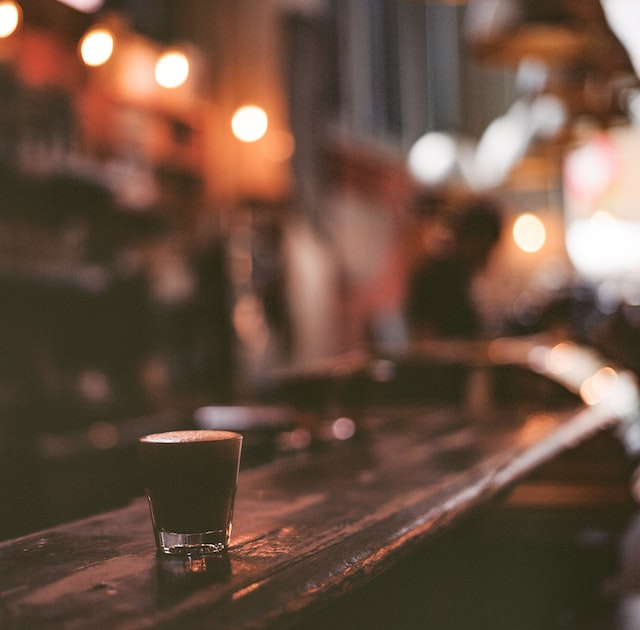
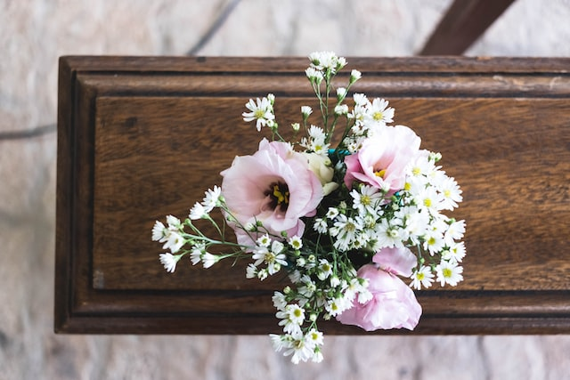

Not good enough to stand alone, but collectively, not so bad huh?

## Stranger

Your mischievous smile lit up the dim corner of the run-down dive bar. You look familiar.

The hand that laid down the first brick of the Great Wall. The noise came from the Colosseum while the gladiators fought to their deaths. The dust registered by the hooves of the ferocious Genghis Khan Army. The gasp while Marco Polo’s tale of the Far East was spreading in the rustic farm town. The rancid smoke from the burning barn carrying patients of the Black Death. The resounding gunfire while the Spanish set foot in a fruitful yet foreign land. The applause after Shakespeare enchanted the audience with his first play. The trenches filled with victories and losses of the brutal war.

You came close to me and whispered in my ear, “Have I seen you before?” Yes, you have. Too many times. I reached my hand out and you grabbed it. “No.” I said. Music drowned out your laughter and the neon light diluted your gorgeous eyes. Hello again.

## The Griefing Period

I met you at her funeral. I came down, missing her laughter and her eyes curved like the crescent moon. You were standing in your wrinkled black suit. Flicking the cigarette were your fingers reddened by the cold. You were her lover. At the eulogy, your deep voice was shaking.

That night, I called you crying, missing her nightly calls to me before depression took away her spark. The other end of the phone call was filled with sadness only describable by your silence.

We bounded through our love for her. Her kindness, the little poem she wrote both of us, her finger nails bitten to so short, and how gorgeously her dress flew in the wind.

Your paint brush dirtied your denim overall. The paint stroke chaotically came together to depict nothing but the breathtaking her. We let the sunset reflect on the painting. She was alive again.

I felt her energy when I was with you. Every breath you took she came out once again, standing at the end of the hallway, head resting on the window, eyelashes shining from her tears filled with melancholy.

When I told you I loved you, you didn’t even question it. Your breath was deep and warm. The room was boiling. Condensation covered the only window in the studio. In the painting, she stared back, emotionless. Your sad eyes stared down, still breathless. This was a mistake. You said.

So why did we make the same mistake so many times after? Did we fall in love with each other, or did we fall in love with grievance? Her shadow was ineradicable and followed us around. We could not talk about anything but how much we missed her. Is it wrong that we are doing this? I asked. You said nothing.

That was our healing process, I supposed. You stopped replying to my texts. Calls left unanswered. You put her behind, and I was the last bit of her remaining in your life waiting to be erased. I missed our late night sorrow and grieving, how your long and well-manicured fingers felt on my skin, the paint that was scattered onto my expensive clothing, and most importantly, how sad and in pain we both were.

I couldn’t blame you. I stopped thinking about her as much. She made me too sad, too vulnerable, and too unstable. I stopped bursting into tears out of nowhere. The same brand of perfume no longer made my eyes red. Funny how fast we forgot someone we loved so deeply.

I prayed to see you again, but my last message to you was left on read for months and months. Your studio light was on, but I no longer had the courage to step into that room full of memories.

I guess that’s how most stories end. The concert jungle of our city dominated the limit of our sadness. We could only stay stagnant so long, right?

> Photo by <a href="https://unsplash.com/@thisusuallyworks?utm_source=unsplash&utm_medium=referral&utm_content=creditCopyText">Richard Payette</a> on <a href="https://unsplash.com/s/photos/collection?utm_source=unsplash&utm_medium=referral&utm_content=creditCopyText">Unsplash</a>
