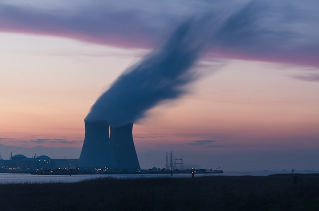
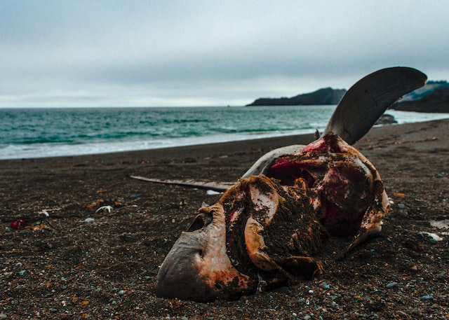
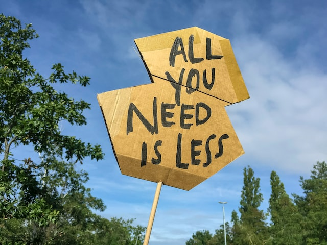

Climate change hadn’t been a conversation I particularly paid attention to. I struggled the same way as Naomi Klein prior to putting down ideas for this book. Climate change is a broad issue that centred a lot on blaming personal choices and less concerned with corporate greed. There was always no end in sight, with fervent opponents still influencing much of the world politics. This book shed some light into the root cause of resistance, the current state (2014) of the battle against climate change, and the hopeful future outlook on this issue.

Klein started the book by documenting some extreme views on the right during the Heartland institute’s international conference on climate change. The vehement denial of climate change is a display of the conservatives’ fear of shifting away from capitalist principles and the extravagant abuse of the Mother Earth. Climate change will indeed change everything. It will change the way we consume, we make money, and companies rely on oil/gas excavation/extraction will no longer be able to justify their damaging behaviour. Unfortunately, gradual change to our way of life can no longer save the planet from its eventual deterioration. Or rather, can save us from the inevitable destruction of global warming. The conservatives backed by big oil companies gathered at the Heartland convention to stop the inevitable shift in consumption and try to manipulate the public to allow the big oil companies to continue making money from putting our future in jeopardy. The truth is, a lot of people who were making an extravagant living off fossil fuels were deeply threatened by climate change. Their ideology that Earth was a source of unlimited provider of wealth was destroyed. The initial failure of most of the initiatives was caused by the difficulty addressing structural inequality and the resistance against socialism. They feared that upholding capitalism might not be feasible in the face of global warming.

Knowing the potential impact of climate change, The big oil companies and other energy players donate 900 million dollars every year to the Heartland institute and other climate denier think tank to prevent the final realization that their greed had taken our future away from us. Despite the looming danger of a warming world, politicians and corrupted scientists still claimed that global warming was a hoax. Some green activists chose to not confront the fervent fury of the climate deniers, trying to suggest the use of a technological solution. Unfortunately, high-tech solutions reinforced the idea of disaster capitalism and brought in extra emission while doing little to make a difference.

Aside from all the deniers muddling up the water, the effort to make a difference has been thwarted by international trade law. Klein talked about the local green initiatives in Ontario, and how trade law had become an unbreakable barrier to meaningful climate change solutions. The dirtier global industrialization which required more transportation and energy waste was preferred to the cleaner local development. UN climate action failed to push for the mention of climate change in trade law led to the many failures of green energy implementation. At the same time, wealthy nations like the US could outsource the dirtiest part of industrialization to developing nations like China and India. Faced with financial needs and rapid development, developing worlds had to accept the self-destruction while becoming the scapegoat for the first world countries. As a result, there was seldom reduction in pollution internationally, while many skilled workers in wealthy nations struggled to find work, leading to nationalism and volatile societies.

Klein proposed a series of methods to combat climate change: cheap public transit, clean light rail, and more housing along transit lines. Cities must be developed for high-density living. The development could benefit people living in poverty by providing more job and education opportunities. Besides supporting low-income communities, a luxury tax could be introduced to discourage non-necessity consumption. Implementing universal basic income could discourage wasteful consumption caused by low life quality such as impulsive shopping and encourage low carbon footprint activities such as gardening and cooking.

Beyond these methods, Klein pointed out the importance of publicizing power infrastructure. A small town in Germany in Hamburg was the example Klein used to amplify the benefits of public power ownership. Hamburg implemented clean power through public ownership and reversing private power grid. As Klein pointed out, private companies put their profits first, and would not make a significant shift to clean power willingly until every last dirty penny had been in their pockets. By making energy a part of the community’s concern, people would feel compelled to make a more sustainable decision.

Klein then indicated that it is undeniable that the increasing frequency of disasters all around the world had increase inequalities among communities. Public funding must prepare for worse climate conditions to come. To support this spending, fossil fuel companies would be heavily taxes for exchanging our future for profits. Many researches had demonstrated that by taxing the oil companies, we would have more than enough to foster a sustainable infrastructure. To rely on private companies to provide and provision power was foolish. A brand-new way to institute decentralized power locally and publicly must be adopted.

Klein hinted that the public held the power to stop damaging and irreversible climate decisions, as the Keystone XL project demonstrated. Without regulations limiting what energy companies could and could not do, our climate future seemed dire. As more resistance came to traditional fossil fuel consumption, dirty innovations such as shale gas and fracking had came to existence. Unfortunately, these unconventional energy sources had proven to be more expensive and dirtier to extract, and they produced equally hefty carbon footprints.

To make a difference that has lasting effect, we must look to the connections we have with Earth. Klein used the failure of Nauru to outline the danger of excusing treating the Earth with violence in the name of ecological growth. The invention of the steam engine had gave us the false sense of security that energy could be manipulated, while the truth was far from it. The attempted control of nature was arrogate and foolish.

The journey to a better relationship with earth seemed to be faced with challenges from compromises and alternative solutions. Even many of the environmental groups like the Nature Conservancy defined climate activism narrowly and accepted donation from major polluters in the name of allyship. It even went as far as performing its own gas extraction.

Some others who want to combat climate change came up with ecological solutions like the carbon tax, yet unethical clever player in the climate game took advantage of any potential flaw. Setting fire to natural gas because it was cheaper, using high emission technology to destroy by-product, and marking nature reserves as a business to sell carbon credits and provide offsets for energy companies.

Green billionaires like Richard Branson vowed to donate billions to groundbreaking solutions, yet the promises had not been met. The technical solutions were nothing more than disappointment. As business owner themselves, they continued to pollute the Earth while being hailed as heroes.

Radical measures such as dimming the sun were even proposed. Klein warned that the atmosphere continued to be a mysterious presence. Such permanent alteration of the climate could lead to unexpected and catastrophic consequences. Geoengineering had done little but delaying real changes that could save us from foreseeable disasters.

Despite the grim prospect on climate groups and innovation gurus, Klein didn’t forget to remind us of the positive outlook for the climate problems. Blockadia described activist groups who hid in plain sight, united by resistance to mining and energy companies. They had achieved success all around the world like no other activism. They showed up in Greece, Canada, US, UK, and any other places where energy companies dared to set foot. Communities linked arms and fought against threats to their nature resources. They had delivered the most success seen in decades.

Another tactics brewing success was the divestment movement. By calling on universities, governments, and organizations to discontinue their financial holding in all fossil companies, the movement put pressures on fossil companies and marked them as undesirable and illegitimate like the tobacco companies. In the court of public opinion, fossil fuel companies had lost their standings.

Among the most fervent participants of Blockadia were indigenous communities, who traditionally held sustainability near and dear to their hearts. Their opposition to energy companies, however, had furthered their economical disadvantage. Many of them struggled to find employment after being passed on by energy companies. Instead of giving in, Blockadia movement had found alternatives. While faced with Economical challenges, indigenous communities educated members on building houses with insulation and provided youth with better opportunities.

While celebrating our success so far, Klein didn't forget to propose a global feed-in tariff. First world countries with high emission should compensate low-pollution developing countries that were faced with harsher environmental challenges.

To close up the book, Klein intimately shared details of her infertility struggle. She drew the connections between pollutions and infertility, the Mother Earth and her own body, her child and baby animals. More than 3 quarters of the chemical was never tested for children. Dramatic decrease in birth and survival rate in different animals mark troubles from excavation failure, global warming, and ocean acidification. At the end, she called for an introspection on our relationship with the Mother Earth, and called for the reproductive rights for the planet as a whole.

To conclude, I have learned a lot about climate change from this book. Though I had been avoiding this topic for a long time, I am now feeling more connected to the issues facing Mother Earth than ever. One action that really resonated with me was when Klein mentioned that the transition to EV and other renewable energy sources would only be a temporary solution. The most effective strategy lies behind developing a new understanding of consumption, building cities fit for high-density living, and taxing the oil companies. There is a culture in today’s capitalist society to consume in more ways than you can imagine. Almost every new technical advancement focuses on how to take users’ data and encourage more consumption. The entire capitalist ecosystem banks on people to spend more to sustain its unsustainable design. At the same time, our Mother Earth is dying for the same consumption ideal.

Klein was right. Climate change will change everything if we want to survive. Our fundamental belief in the capitalist infrastructure must be mended or abandoned to save ourselves before it is too late. As progressives, we must fight harder than the republicans and those who profit from extravagant spending to defeat the climate deniers and the powerful fossil fuel companies. The first step to this journey is to educate ourselves on the influence fossil fuel consumption has on our daily life and how much the capitalist spending habits have damaged our environment. If you have been hesitant to get involved with climate issues, this book is a great starter kit for you to become more aware and comfortable when it comes to climate change. The only way to ensure we are not robbing our grandkids of a future filled with beautiful animals and stunning landscape is to act now. Only collectively we can pressure the leaders of the world for more effective legislation and fair taxation of the rich.
